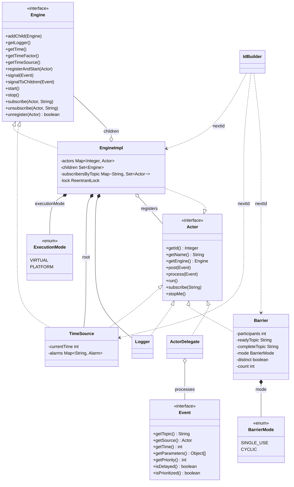
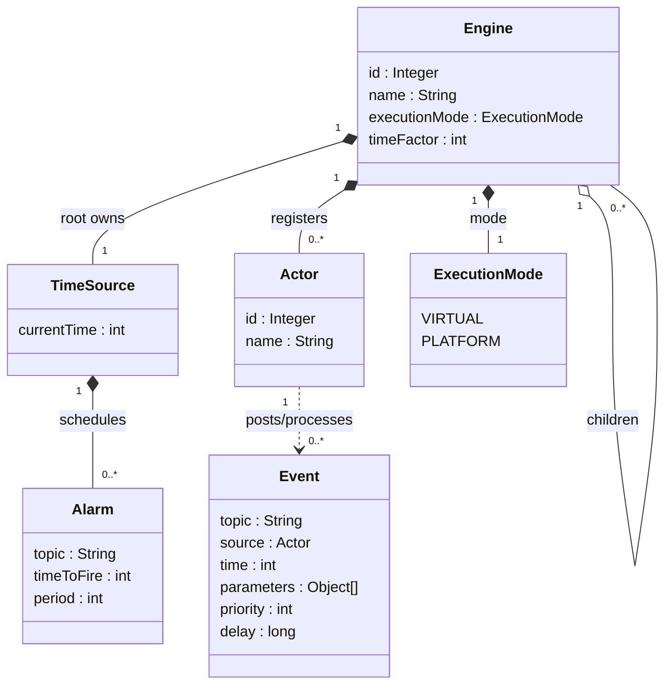
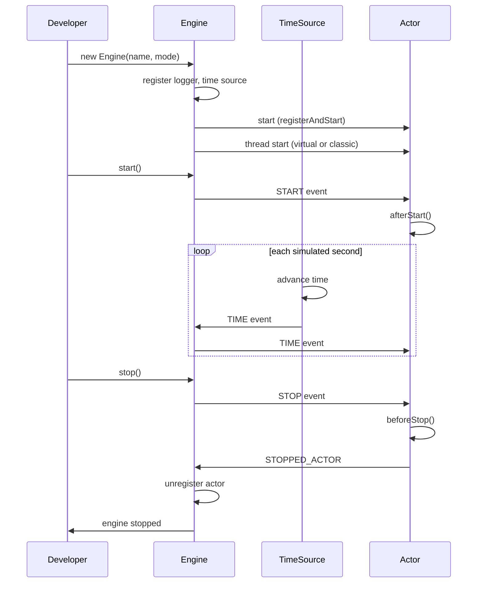
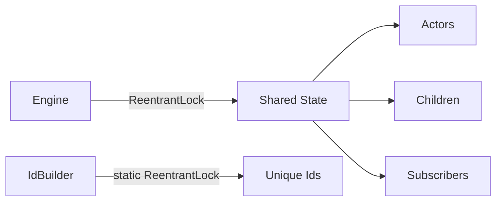

# SIMULA Architecture

This document describes the current architecture of the simula discrete-event simulation framework. It reflects the system as implemented today and contains no historical information.

## Overview

SIMULA is a Java 23 library that provides an actor-based discrete-event simulation framework. A root **Engine** orchestrates actors and child engines. Each actor subscribes to named topics and processes the events posted to those topics. A single **TimeSource** advances simulated time and signals a time event each simulated second. Events may be standard, prioritized, or delayed.

Actors execute on threads; the engine selects the thread strategy (virtual by default, or classic platform threads) via an `ExecutionMode` configuration. Shared engine state is guarded by explicit reentrant locks.

## Component Model

## Data Model

## Lifecycle

## Concurrency

Shared engine state (registered actors, child engines, and topic subscriptions) is guarded by a per-engine `ReentrantLock`. The id builder uses a static `ReentrantLock` to produce unique ids across threads. Event delivery is asynchronous through per-actor queues (standard, priority, or delay).

## Key Decisions

- **Execution mode**: actors run on virtual threads by default; classic platform threads are selected explicitly via an `ExecutionMode` constructor parameter (FR-001..FR-004).
- **Locking**: all `synchronized` monitors are replaced with explicit `ReentrantLock` for uniform, explicit concurrency semantics (FR-010..FR-012).
- **Unique ids**: a central `IdBuilder` assigns unique integer ids to engines, actors, and loggers.

## Requirements Traceability

- ExecutionMode: FR-001, FR-002, FR-003, FR-007
- Engine thread strategy: FR-004, FR-006, FR-008
- Behavioral equivalence: FR-005, FR-013
- Concurrency/locking: FR-010, FR-011, FR-012
