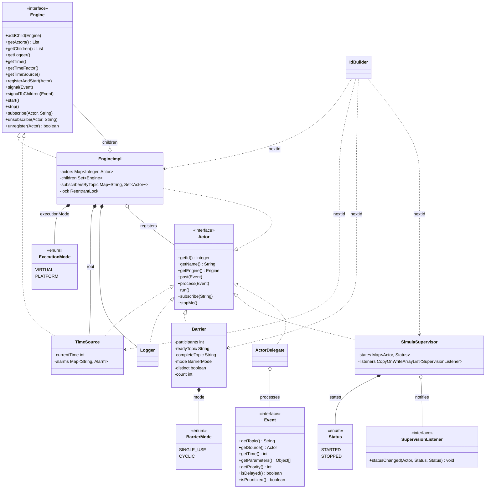
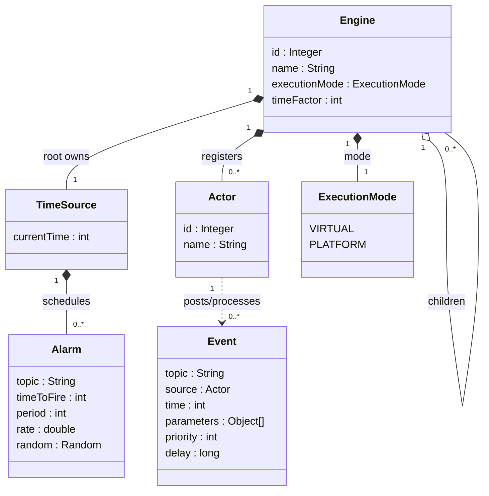
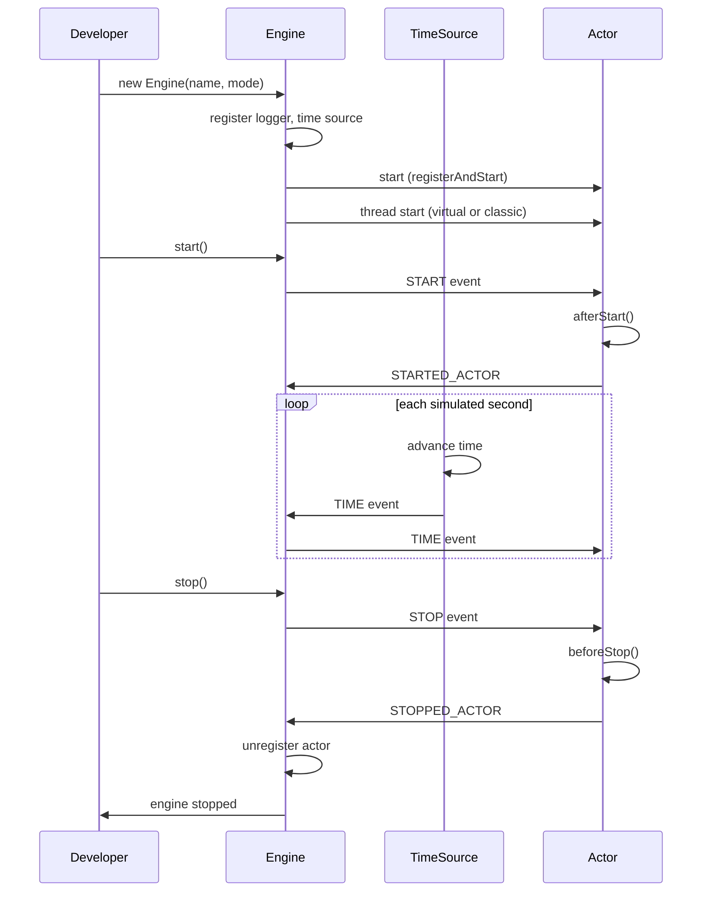
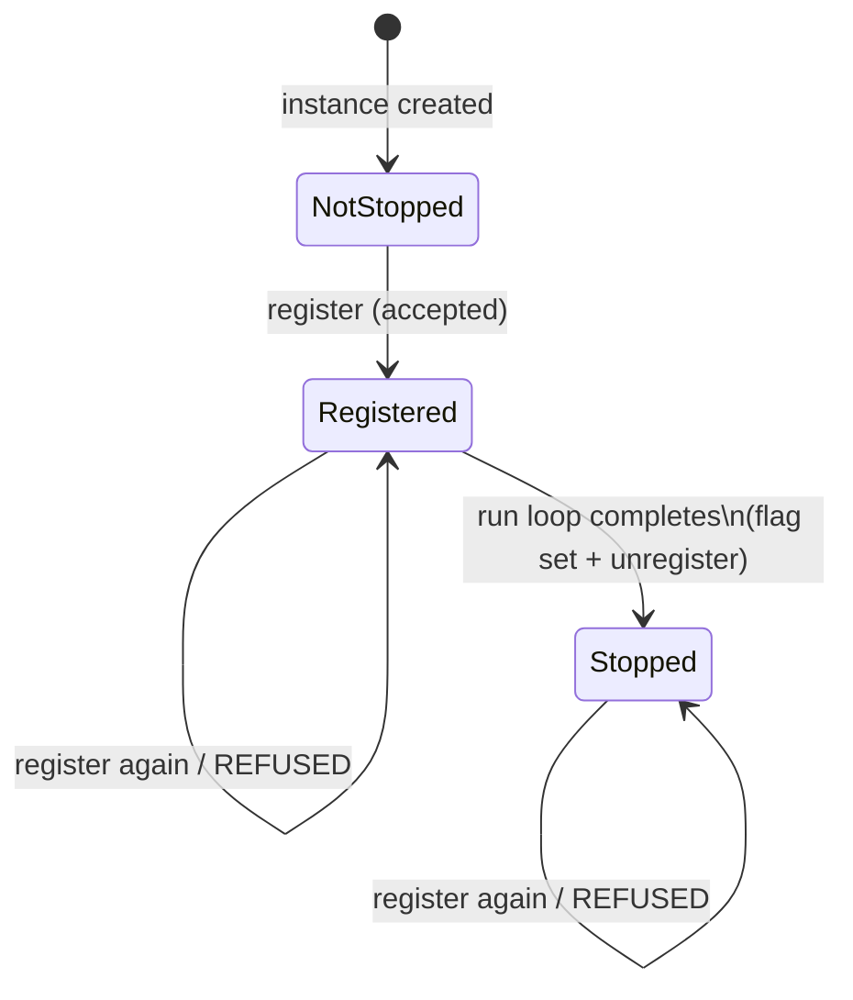
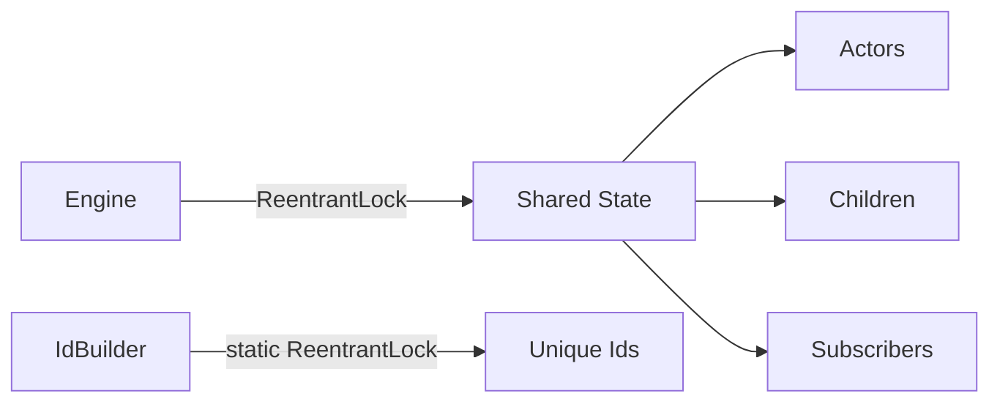

# SIMULA Architecture

This document describes the current architecture of the simula discrete-event simulation framework. It reflects the system as implemented today and contains no historical information.

## Overview

SIMULA is a Java 23 library that provides an actor-based discrete-event simulation framework. A root **Engine** orchestrates actors and child engines. Each actor subscribes to named topics and processes the events posted to those topics. A single **TimeSource** advances simulated time and signals a time event each simulated second. Events may be standard, prioritized, or delayed.

Actors execute on threads; the engine selects the thread strategy (virtual by default, or classic platform threads) via an `ExecutionMode` configuration. Shared engine state is guarded by explicit reentrant locks.

## Component Model

## Data Model

## Lifecycle

Stopping is terminal: after `STOPPED_ACTOR` and unregistration, an actor instance reports `isStopped() == true` and the engine refuses to register it again. `register` refuses, before any mutation, under the engine lock: (1) an actor reporting `isStopped()`, (2) an instance held in the engine's weak memory of unregistered-after-stop instances, or (3) an id already present in the registered-actor map; each refusal logs an engine error and throws `IllegalArgumentException` (FR-001..FR-003, FR-005, FR-008).

The stopped-instance memory uses weak references, accessed under the engine `ReentrantLock`: it backstops actors whose custom delegation does not report `isStopped()`, and releases entries when the application no longer references the instance, so it never grows with the cumulative stop count (FR-005, FR-006).

## Concurrency

Shared engine state (registered actors, child engines, and topic subscriptions) is guarded by a per-engine `ReentrantLock`. The id builder uses a static `ReentrantLock` to produce unique ids across threads. Event delivery is asynchronous through per-actor queues (standard, priority, or delay).

> **`synchronized` is prohibited.** Because actors run on virtual threads by default, a `synchronized` block pins its virtual thread to its carrier thread for the duration of the lock hold, cancelling the scalability benefit of virtual threads and potentially starving every other actor sharing that carrier. All mutual exclusion, inside the framework and in user actors, MUST use `java.util.concurrent.locks.ReentrantLock` (or other `java.util.concurrent` synchronizers), which are virtual-thread-friendly.

## Key Decisions

- **Execution mode**: actors run on virtual threads by default; classic platform threads are selected explicitly via an `ExecutionMode` constructor parameter (FR-001..FR-004).
- **Locking**: `synchronized` monitors are prohibited because they pin virtual threads to their carrier; explicit `ReentrantLock` is used for uniform, explicit, virtual-thread-friendly concurrency semantics (FR-010..FR-012).
- **Late registration**: an actor registered after the engine's `start()` gets the `START` event posted to it at registration (the engine remembers it has started), so it runs `afterStart()` and signals `STARTED_ACTOR_EVENT` like an actor registered before the start.
- **No actor restart**: the stopped state is terminal and carried by the actor (standard `ActorDelegate` and `TimeSource` set it when their run loop completes); the engine guard at registration refuses stopped or currently-registered instances with an error log and an `IllegalArgumentException`, leaving engine state untouched (005-FR-001..FR-008).
- **Poisson alarms**: an alarm request may replace the fixed period by the `TimeSource.POISSON` marker plus a positive rate and an optional seed; the alarm then re-arms until cleared, each wait drawn (inverse-CDF exponential, scaled by the time factor, floored at one simulated unit) from a `Random` owned by the alarm alone, so a seeded sequence is reproducible and independent of other alarms (007-FR-001..FR-007).
- **Unique ids**: a central `IdBuilder` assigns unique integer ids to engines, actors, and loggers.
- **Lifecycle supervision**: a `STARTED_ACTOR_EVENT` is signaled by a component when it begins its behavior, symmetric to `STOPPED_ACTOR_EVENT`. The built-in actors (via standard delegation), the engine, and the time source emit it for themselves; a `SimulaSupervisor` subscribes to it and to the stop events and exposes a queryable started/stopped state (FR-001..FR-010). A supervisor constructed after some actors started seeds them as `STARTED` from the engine's registered-actor snapshot, so no start is missed on its own engine. The engine also exposes its child engines as a non-modifiable, ordered list via `getChildren()` (FR-011) and its actors as a non-modifiable, ordered list via `getActors()` (FR-012). Actors from external projects that do not use standard delegation are not forced to emit it; the contract is documented (FR-007). `SimulaSupervisor` also accepts registered `SupervisionListener`s: each actual status transition is reported synchronously, in the recording thread, after the new status is visible in `getStates()`; a listener that throws is isolated and logged, and listener registration/unregistration is safe from any thread.

## Requirements Traceability

- ExecutionMode: FR-001, FR-002, FR-003, FR-007
- Engine thread strategy: FR-004, FR-006, FR-008
- Behavioral equivalence: FR-005, FR-013
- Concurrency/locking: FR-010, FR-011, FR-012
- SimulaSupervisor/lifecycle event: FR-001..FR-010
- Expose engine children (`getChildren()`): FR-011
- Expose engine actors (`getActors()`): FR-012
- Forbid actor restart (`isStopped()`, registration guard): 005-FR-001..005-FR-008
- Poisson alarms (`TimeSource.POISSON`, rate, seed): 007-FR-001..007-FR-007
