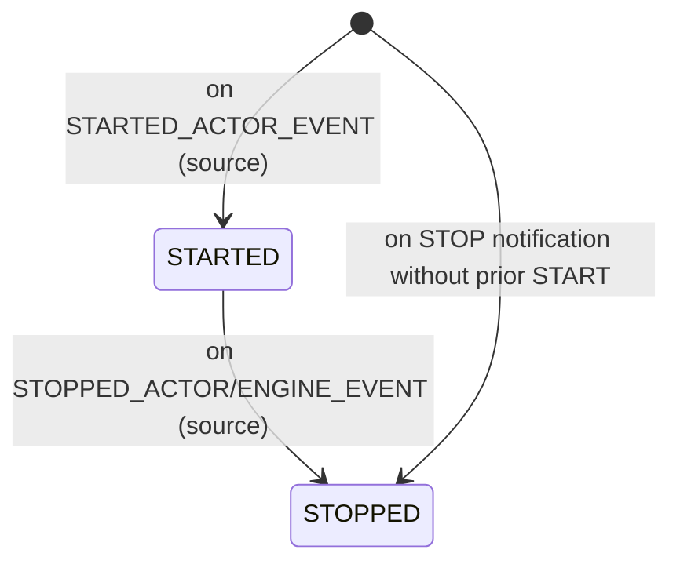

# Data Model: Add Supervision Actor

**Branch**: `004-supervision-actor` | **Date**: 2026-09-29 | **Spec**: [spec.md](spec.md)

Phase 1 output of `/speckit.plan`.

## Entities

### Startup Notification (STARTED_ACTOR_EVENT)

A lifecycle notification emitted when an actor begins its behavior.

- Attributes:
  - `source` (Actor): the actor that started.
- Relationship: emitted by the built-in actors (via standard delegation), the engine, and the time source for themselves; emitted by external actors when they follow the documented contract.
- Validation: the source is the actor that started.

### Stop Notification (STOPPED_ACTOR_EVENT / STOPPED_ENGINE_EVENT)

An existing lifecycle notification emitted when an actor or child engine stops.

- Attributes:
  - `source` (Actor/Engine): the component that stopped.
- Relationship: `STOPPED_ACTOR_EVENT` is emitted by actors; `STOPPED_ENGINE_EVENT` is emitted by child engines to their parent.

### Supervision Actor

An actor that subscribes to lifecycle notifications, records them, and exposes a queryable state.

- Attributes:
  - `id` (Integer): unique identity.
  - `delegate` (Actor): the standard delegation for the event loop.
  - `engine` (Engine): the engine that runs the supervision actor.
  - `states` (Map<Actor, Status>): observed component to lifecycle status.
- Relationships:
  - subscribes to `STARTED_ACTOR_EVENT`, `STOPPED_ACTOR_EVENT`, `STOPPED_ENGINE_EVENT`.
  - observes zero or more actors/engines.

### Status

The lifecycle status of an observed component.

- Values: `STARTED`, `STOPPED`.

## State transitions

## Validation rules

- FR-009: the supervision state must always match the sequence of notifications received.
- FR-010: a stop notification for a component not observed starting is recorded directly as `STOPPED`, without error.
- FR-006: the queryable state reports each observed component and its lifecycle status.
