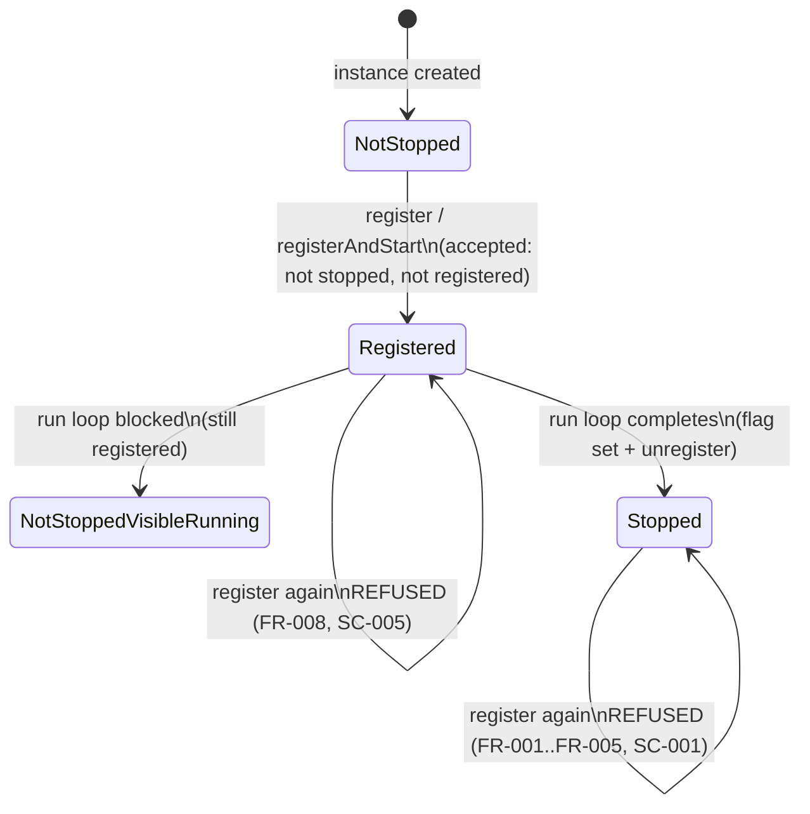

# Phase 1 Data Model: Forbid Actor Restart

**Branch**: `005-forbid-actor-restart` | **Date**: 2026-09-30 | **Spec**: [spec.md](spec.md)

## Entities

### Stopped actor status (per actor instance)

| Aspect | Definition |
|--------|------------|
| Owner | The actor instance itself (reported via `Actor.isStopped()`, FR-004) |
| Production | Standard delegation only: `ActorDelegate` sets its `stopped` flag once, in the `finally` of `run()` (after any `STOPPED_ACTOR_EVENT` signal) |
| Values | `false` (never stopped — fresh or running) → `true` (terminal) |
| Contract | Custom delegations SHOULD override `isStopped()` to report their own terminal state; if they do not, the engine backstop (below) still covers them (FR-005) |

### Stopped-instance memory (per engine)

| Field | Type (internal) | Notes |
|-------|-----------------|-------|
| `stoppedInstances` | set with weak element references | Written in `unregister()` on the successful-removal branch (non-engine actors only); read in `register()`; accessed exclusively under the engine `ReentrantLock`; entries are reclaimed when the instance becomes unreachable (FR-006) |

### Registered-actors map (existing, unchanged shape)

| Field | Notes |
|-------|-------|
| `actors` (id → actor) | Sole registration truth; the guard reads `actors.containsKey(actor.getId())` to refuse double registration (FR-008) |

## State transitions (actor instance, as enforced by one engine)

## Validation rules

| Rule | Source | Enforcement point |
|------|--------|-------------------|
| REF-1: refuse if actor reports `isStopped() == true` | FR-001, FR-002 | `EngineImpl.register()` check 1 |
| REF-2: refuse if instance is in `stoppedInstances` (custom-delegate backstop) | FR-005 | `EngineImpl.register()` check 2 |
| REF-3: refuse if `actors` already holds the actor id | FR-008 | `EngineImpl.register()` check 3 |
| ACCEPT-1: accept a fresh instance even when a same-name actor stopped (ids differ) | FR-007 | ids from `IdBuilder` are unique |
| NO-TRACE: on any refusal, no map put, no subscription, no thread start | FR-003 | checks precede all mutation; exception propagates |
| BOUNDED: bookkeeping must not retain unreachable instances | FR-006 | weak references only (R3/R4) |
| UNDISTURBED: a refusal must not affect the actor's ongoing execution | FR-008 | refusal occurs before any interaction with the actor |

## Relationships

- One **engine** owns one **stopped-instance memory** and one **registered-actors map**; an actor **instance** is known to at most one engine (no migration — Assumption).
- The **stopped flag** and the **stopped-instance entry** describe the same fact; the engine refuses if *either* source reports it (belt-and-braces, per clarification session and R2/R3).
