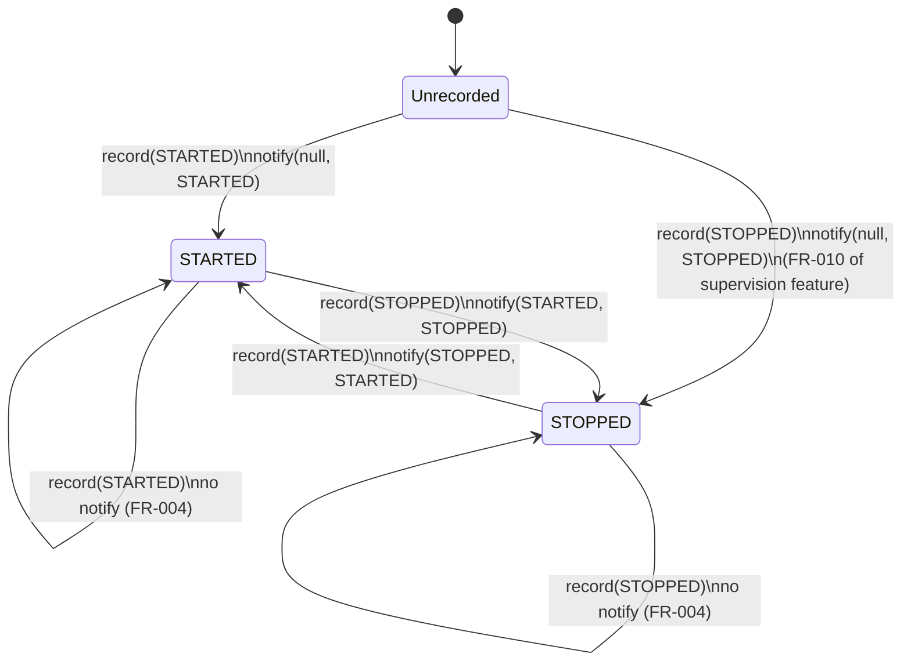

# Phase 1 Data Model: Supervision Listener

**Branch**: `006-supervision-listener` | **Date**: 2026-10-02 | **Spec**: [spec.md](spec.md)

## Entities

### Supervision listener (per supervisor)

| Aspect | Definition |
|--------|------------|
| Type | `SupervisionListener` — public `@FunctionalInterface` in `jpnco.simula.actors` (FR-002) |
| Callback | `statusChanged(Actor component, SimulaSupervisor.Status previous, SimulaSupervisor.Status current)`; `previous` is `null` iff this is the component's first record |
| Invocation | Synchronously, in the thread that performed the record, after the state map update (FR-003) |
| Thread-safety duty | Listener implementations must tolerate concurrent invocations and should not block (documented, per spec Assumptions) |

### Listener registry (per supervisor)

| Field | Type (internal) | Notes |
|-------|-----------------|-------|
| `listeners` | `CopyOnWriteArrayList<SupervisionListener>` | Written by `addSupervisionListener` (`addIfAbsent`) and `removeSupervisionListener`; iterated per notification; lock-free reads; safe from any thread including inside a callback (FR-006) |

### State map (existing, unchanged shape)

| Field | Notes |
|-------|-------|
| `states` (`ConcurrentHashMap`) | Transition detection reads the per-entry previous value from `put`'s return (FR-003, FR-004); map semantics unchanged |

## Notification rule

## Validation rules

| Rule | Source | Enforcement point |
|------|--------|-------------------|
| L-NULL: `add(null)` / `remove(null)` raise `NullPointerException`, registry unchanged | FR-001, FR-007 | `Objects.requireNonNull` in add/remove |
| L-DUP: registering the same listener instance twice is a no-op → exactly one notification per transition | FR-001 | `CopyOnWriteArrayList.addIfAbsent` (duplicate detection is `equals`-based: identity for typical lambda/anonymous listeners, documented) |
| L-GONE: removal takes effect for every subsequent record; removing an absent listener is silent | FR-007 | `remove` on COW list |
| N-TRANS: notify each listener iff `previous != status` for the write performed | FR-003, FR-004 | `record()` compares `put`'s return |
| N-ORDER: notification happens after the map update (a listener reading `getStates()` sees `current`) | FR-003 | notify after `put` |
| N-FAULT: a listener exception is caught per listener and logged (`Logger.error`); recording and other listeners unaffected | FR-005 | `try/catch (RuntimeException)` around each callback |
| N-FAST: with an empty registry, no allocation and no behavior change | FR-008, SC-004 | `listeners.isEmpty()` fast path |

## Relationships

- One **supervisor** owns one **listener registry** and one **state map**; a listener instance may be registered on several supervisors independently.
- One **status transition** (edge of the state diagram above) produces one notification per registered listener; no-change records produce zero notifications (SC-001).
