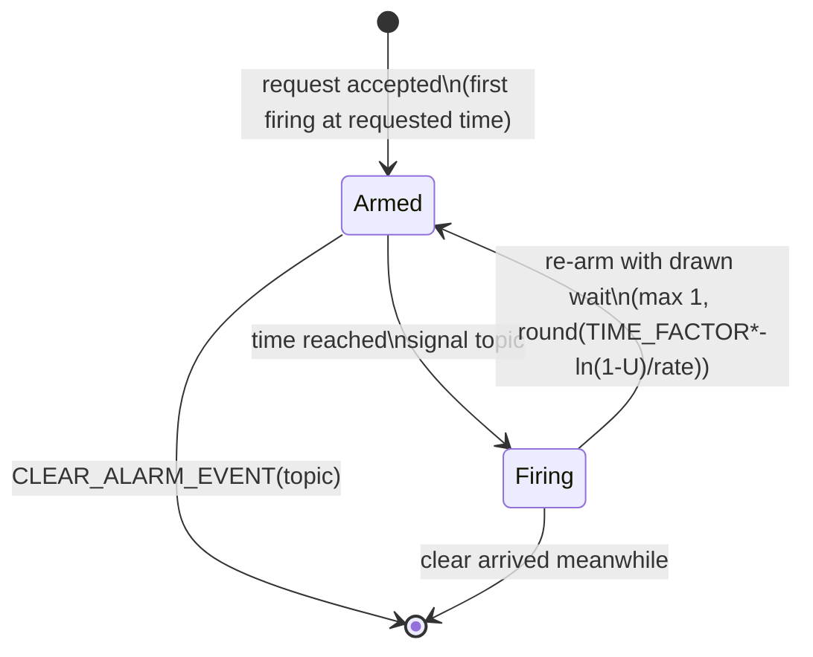

# Phase 1 Data Model: Poisson Alarm

**Branch**: `007-poisson-alarm` | **Date**: 2026-10-05 | **Spec**: [spec.md](spec.md)

## Entities

### Alarm (inner class of TimeSource) — extended

| Field | Type | Notes |
|-------|------|-------|
| `topic` | `String` | unchanged |
| `timeToFire` | `int` | unchanged: next firing instant in internal time units |
| `period` | `int` | unchanged; `NO_PERIOD` for one-shot AND rate-mode alarms (re-arm comes from the draw, not the period) |
| `rate` | `double` | NEW: Poisson rate (mean firings per real simulated unit), `<= 0` when not rate mode |
| `random` | `Random` | NEW: owned by this alarm; seeded or not per request (FR-003, FR-007) |

Re-arm rule (FR-002, R2): `advance()` becomes, for rate mode, `timeToFire += max(1, round(TIME_FACTOR * -ln(1-U) / rate))`; fixed-period mode keeps `timeToFire += period`. `isPeriodic()` reports `true` for rate mode (it re-arms until cleared, FR-001).

### Request parameters (`REQUEST_ALARM_EVENT`)

| Shape | Meaning | Status |
|-------|---------|--------|
| `(String topic, Integer time)` | one-shot | unchanged (FR-005) |
| `(String topic, Integer time, Integer period)` | fixed period | unchanged (FR-005) |
| `(String topic, Integer time, "POISSON", Double rate)` | Poisson, unseeded | NEW (FR-001) |
| `(String topic, Integer time, "POISSON", Double rate, Number seed)` | Poisson, seeded | NEW (FR-001, FR-003) |
| marker present, rate absent/non-Double/`<= 0`, or seed non-Number | refused: error logged, no alarm | NEW (FR-006) |

## State transitions (rate-mode alarm)

## Validation rules

| Rule | Source | Enforcement point |
|------|--------|-------------------|
| PA-MARKER: Poisson shape requires marker at index 2 and a `Double` rate at index 3 | FR-005, FR-006 | `processRequestAlarm` detection |
| PA-RATE: rate must be `> 0` or the request is refused (error logged, map untouched) | FR-006 | `processRequestAlarm` |
| PA-SEED: optional seed at index 4 must be a `Number` or the request is refused | FR-006 | `processRequestAlarm` |
| PA-GAP: every drawn wait is at least 1 internal unit | FR-002, SC-003 | `drawWait` |
| PA-SEED-REPLAY: same rate + same seed ⇒ identical wait sequence | FR-003, SC-001 | per-alarm `new Random(seed)` |
| PA-OWN: one alarm's draws never touch another's | FR-007 | per-alarm `Random` |
| REPLACE: one alarm per topic, newest wins | FR-005 | unchanged `alarms.put` |

## Relationships

- One **request** creates at most one **alarm** (replacing any alarm on the same topic); one **alarm** owns exactly one **random source** whose lifetime equals the alarm's (a re-request with the same seed restarts the sequence).
- The **time source** remains the sole owner of the `alarms` map and of firing; accessed only from its run thread (unchanged).
